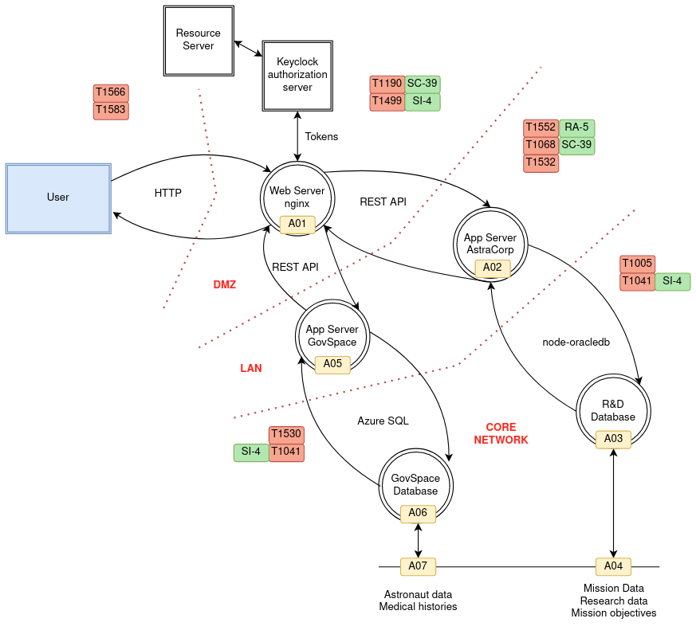

# Scenario

## Description

AstraCorp is a R&D company dedicated to space engineering and space-compatible nano-components. It collaborates with 
public institutions on a research-level, as well as for database management. The company's goal is to perform research
on different fields related to space engineering, as well as to store sensitive mission data for processing and testing.
AstraCorp also works with private stakeholders investing money in Space R&D.  AstraCorp possesses a Cybersecurity 
department, with a Risk Assessment as well as an Operational teams.

## Context

Astracorp works with the public institution GovSpace for R&D purposes. The following primary and supporting assets are
used in their collaboration:

### Primary

* Sensitive data about mission samples
* Medical histories of astronauts

### Supporting

* Webserver used for querying data in HTTP
  * cpe:2.3:a:hypr:keycloak_authenticator:-:*:*:*:*:*:*:* 
  * cpe:2.3:a:f5:nginx:1.1.1:*:*:*:*:*:*:*
* Web application made with node.js:
  * cpe:2.3:a:openjsf:express:4.3.1:*:*:*:*:node.js:*:*
  * cpe:2.3:a:nodejs:node.js:6.2.1:*:*:*:lts:*:*:*
* Database for AstraCorp sensitive data storage 
  * cpe:2.3:a:oracle:mysql:8.0.18:*:*:*:*:*:*:*
* Cloud for Medical histories
  * cpe:2.3:a:microsoft:azure_open_management_infrastructure:-:*:*:*:*:*:*:*

###  Threat Actors

#### Advanced

We define an advanced threat actor whose goal is to access and leak sensitive data from GovSpace's cloud.
* adversaryType: spy
* sophistication: strategic
* opportunity: high
* motivation: critical
* capabilities: critical

We define an advanced threat actor whose goal is to access and leak sensitive data from AstraCorp's database.
* adversaryType: crime-syndicate
* sophistication: expert
* opportunity: high
* motivation: critical
* capabilities: high

* Reconnaissance
* Spear Phishing T1566
* Exploitation for Privilege Escalation T1068
* Lateral Movement T1570
* Credential Access T1552
* Azure Cloud Environment T1532 /
* Exfiltrate Data T1002

#### Intermediate

We define an intermediate threat actor whose goal is to prevent accessibility through denial of service of the nginx
webserver.

* adversaryType: hacker
* sophistication: advanced
* opportunity: medium
* motivation: high
* capabilities: medium
  "threatVectors": ["DENIAL_OF_SERVICE"]

* Reconnaissance
* Resource Development T1583
* T1190 Exploit Public-Facing Application
* T1499
### Threat Model

#### Diagram

### Metrics mapping

Here is the exhaustive list of the metric mapping.

* CPE match:
  * VERY HIGH if match
  * LOW if no match
  * applied to a CVE
* Sector Match:
  * Takes into account the sector and organization type, map it into a 5-level scale
  * applied to a malware, threat actor, identity
* Geographical similarity:
  * Takes into account the region, country, languages of the organization
  * Can be applied to a malware, threat actor, identity
* Objective match
  * Computes a string similarity score between the TRA's threat model and a campaign goal / description
  * take max / min?
* Last seen campaign
  * timestamp
  * threat actor
* Last seen attack
  * timestamp
  * malware,tool,infrastructure,indicators. Different weights per objects (indicators have low weight)
* Sophistication
  * 7-level scale of a threat actor
  * mapped to the 5-level scale
* adversary type
  -> map each stix type to some severity (from TRA)
* Opportunities
  -> 
* Resource level:
 ?
* SFR/SAR:
  * not used in the Tree
  * used for output, as a guidance or reminder (already implemented mitigations, related mitigation...)
* Security Objective impact: REFACTOR mandatory
  ?
  * Mean of the SO metrics
  * Mean of the matching CAPEC/TTPs risk metric (likelihood * impact)

* change the SFR (remove from bayesian tree)
* add it in the output + new potential mitigations
* add terms, definitions, glossary /lexicon

